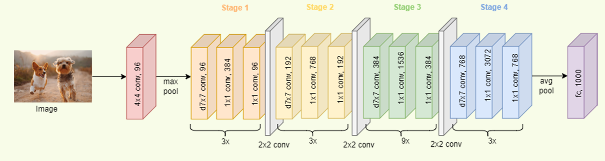

# Lung Disease Classification and Localization using Deep Learning  

## 📌 Overview  
This project implements **deep learning models** to classify and localize lung diseases using **chest X-ray images**. It utilizes **ConvNeXt** for multi-label disease classification and **Swin Transformer** for disease localization, improving diagnostic accuracy in medical imaging.  

---

## 🔍 Key Features  
- ✅ **Multi-label Classification**: ConvNeXt-based model achieving **80.11% AUC** on ChestX-ray14 dataset  
- ✅ **Disease Localization**: Swin Transformer-based localization achieving **79% IoU**  
- ✅ **Grad-CAM Visualization**: Helps interpret model predictions by highlighting important regions  

---

## 📂 Datasets Used  
- **[ChestX-ray14](https://nihcc.app.box.com/v/ChestXray-NIHCC)** – 112,120 chest X-rays for classification  
- **[MIMIC-CXR](https://physionet.org/content/mimic-cxr/2.0.0/)** – 377,110 chest X-ray images for multi-task learning  
- **[VinDR-CXR](https://vindr.ai/datasets/vindr-cxr)** – 18,000 expert-annotated X-ray images for localization  

---

## 🏗 Model Architectures  

### 🏥 **1️⃣ Classification: ConvNeXt**  

- A modern **CNN-based model** with residual connections and **layer normalization**  
- Trained on **ChestX-ray14** dataset to classify **14 lung diseases**  
- Achieved **80.11% AUC** on the test set  

### 🏥 **2️⃣ Localization: Swin Transformer**  

- A **hierarchical vision transformer** that captures spatial relationships  
- Trained on **VinDR-CXR** dataset for disease localization  
- Achieved **79% Intersection over Union (IoU)** in identifying diseased regions  

---

# 🚀 Results  

| Task           | Model            | Performance  |
|---------------|-----------------|-------------|
| Classification | ConvNeXt         | 80.11% AUC  |
| Localization  | Swin Transformer | 79% IoU     |

---

## 📊 Performance Metrics  
- 📌 **AUC (Area Under Curve)** – Classification  
- 📌 **IoU (Intersection over Union)** – Localization  
- 📌 **Grad-CAM** – Class Activation Map for interpretability  

---

## 📝 Future Improvements  
🔹 Experiment with **multi-task learning** to improve classification and localization jointly  
🔹 Apply **self-supervised learning (DINO)** for better feature extraction  
🔹 Enhance **attention mechanisms** for more precise localization  

---

## 📜 References  
📌 **ConvNeXt**: [Paper](https://arxiv.org/abs/2201.03545)  
📌 **Swin Transformer**: [Paper](https://arxiv.org/abs/2103.14030)  

